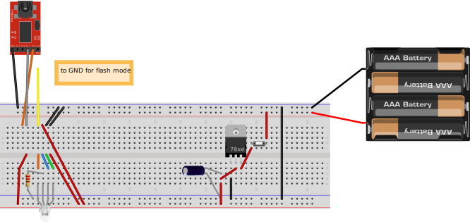

# HomeButton
This project is a very basic Home Button for my own personal use.

The idea is simple, when kids are back from school they push the button and then it sends a notification on a web service (push bullet) that goes ultimately on my phone (and my wife's).

Code for an ESP8266, heavily inspired on various makers here and there.

